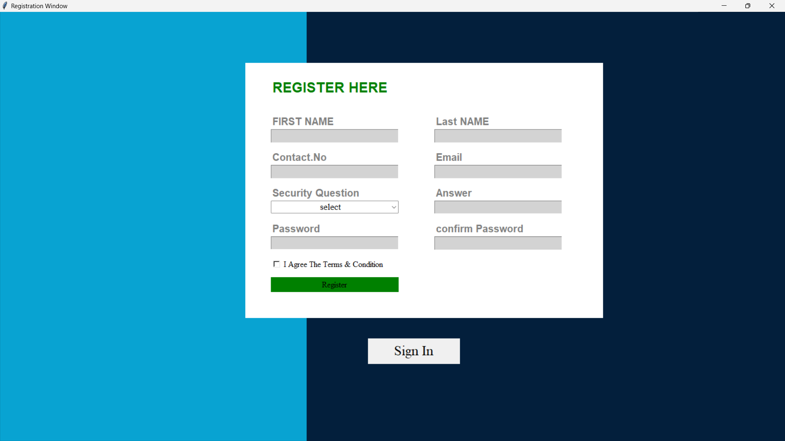
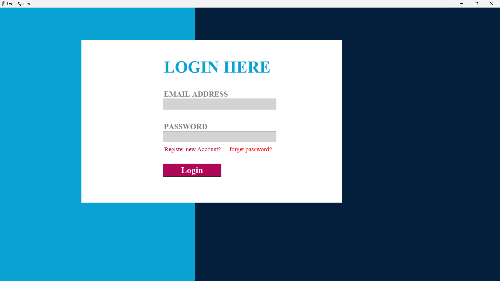
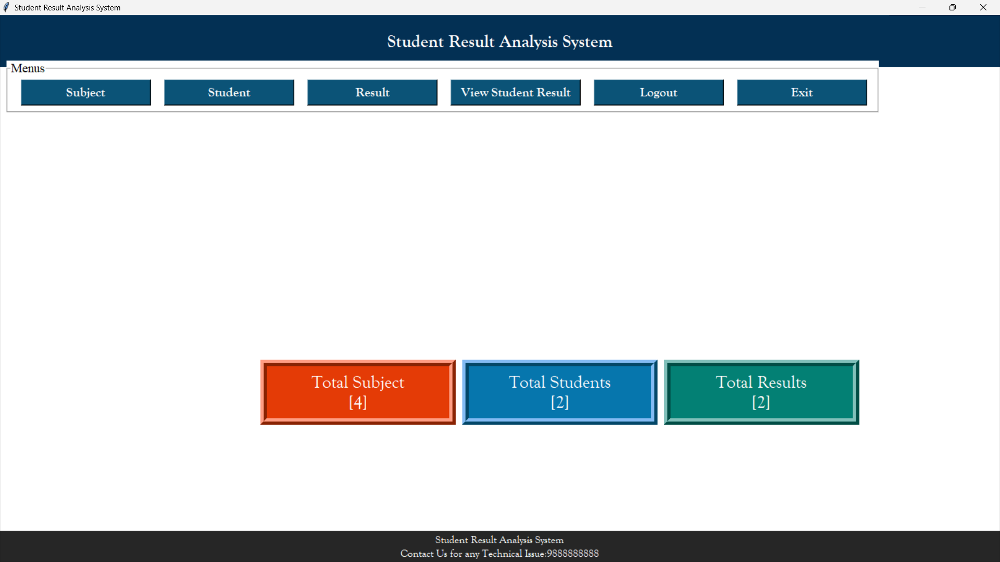
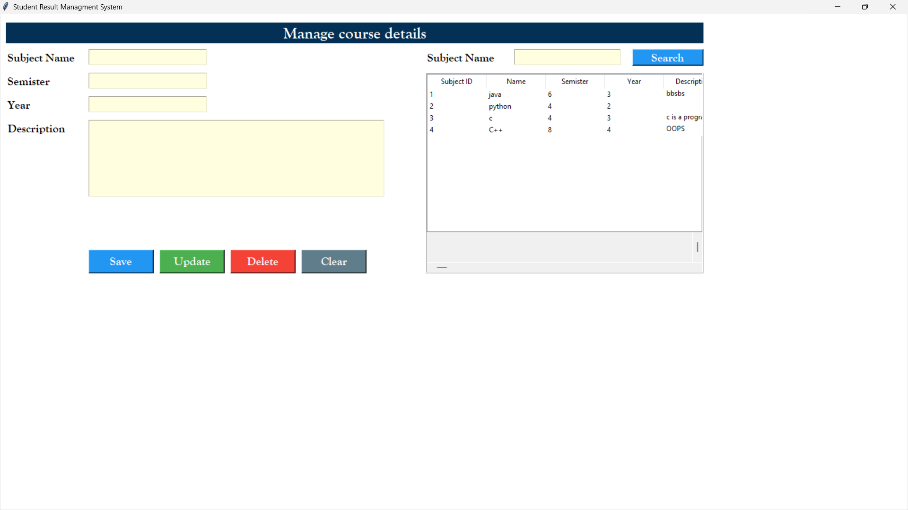
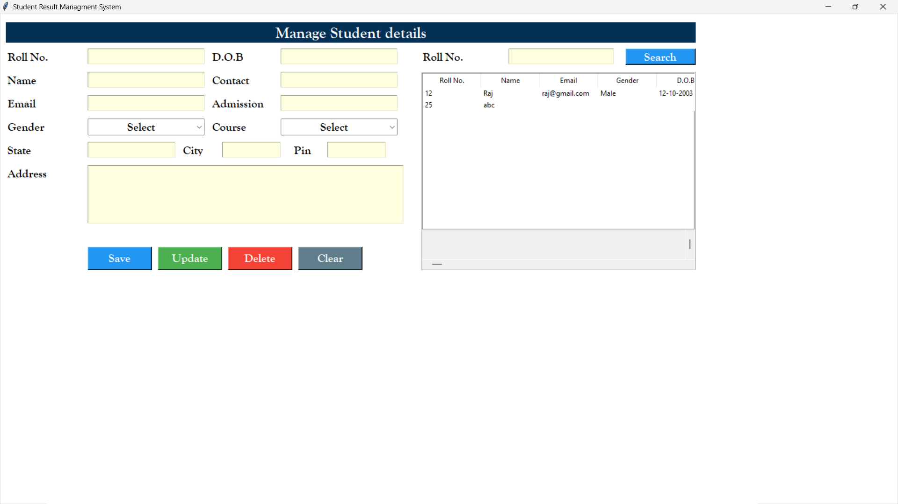
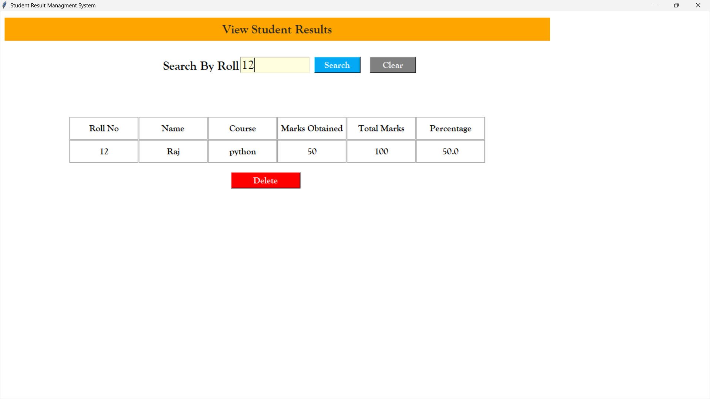
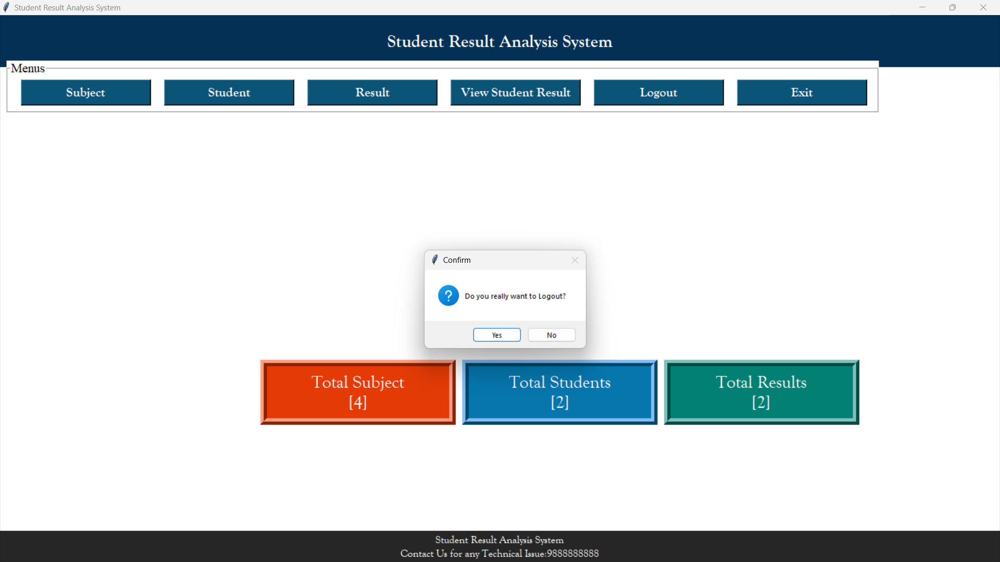

# Student Result Management System

## 📌 Project Overview
The **Student Result Management System (RMS)** is a Python-based desktop application built using **Tkinter** for GUI and **SQLite** for database management. It allows administrators to manage student details, subjects, results, and generate reports efficiently.

## 🚀 Features
- **User Authentication**: Secure login and registration system.
- **Course Management**: Add, update, and delete subjects.
- **Student Management**: Maintain student records.
- **Result Management**: Enter and modify student marks.
- **Report Generation**: View student performance reports.
- **Dashboard**: Displays total subjects, students, and results.
- **GUI-Based Interface**: Built with Tkinter for an easy-to-use experience.

## 🛠️ Tech Stack
- **Language**: Python
- **GUI Library**: Tkinter
- **Database**: SQLite

## 📂 Project Structure
```
RMS/
│── course.py            # Course management module
│── create_DB.py         # Database initialization script
│── Dashboard.py         # Main dashboard interface
│── login.py             # User authentication system
│── register.py          # User registration system
│── report.py            # Report generation module
│── result.py            # Result management module
│── student.py           # Student data management module
│── rms.db               # SQLite database file
│── screenshots/         # Folder containing UI images
│── README.md            # Project documentation
```

## 📸 Screenshots
### 1️⃣ **User Registration**


### 2️⃣ **User Login**


### 3️⃣ **Dashboard**


### 4️⃣ **Manage Course Details**


### 5️⃣ **Manage Student Details**


### 6️⃣ **Add Student Result**


### 7️⃣ **View Student Result**


### 8️⃣ **Logout**


## 🛠️ Setup & Installation
1. **Clone the Repository**
   ```sh
   git clone https://github.com/mrYassh/StudentResultManagementSystem.git
   cd StudentResultManagementSystem
   ```
2. **Install Dependencies**
   - Ensure Python is installed (Recommended: Python 3.8+)
   - Install required libraries:
     ```sh
     pip install pillow
     ```
3. **Run the Application**
   ```sh
   python login.py
   ```

## 📌 Usage
- **Login/Register**: Start with login or create a new account.
- **Manage Courses**: Add, update, and delete subjects.
- **Manage Students**: Store student details.
- **Enter Results**: Record marks for students.
- **Generate Reports**: View student performance.

## 🛡️ Security Enhancements
- Implement password hashing (recommended for authentication security).
- Add role-based access control (e.g., admin vs. student views).

## 📌 Future Enhancements
- Export reports as PDFs.
- Improve UI consistency and responsiveness.
- Add search functionality for students and subjects.

## 🤝 Contributing
1. Fork the repository.
2. Create a new branch (`feature-branch`).
3. Commit changes (`git commit -m 'Added feature X'`).
4. Push to GitHub (`git push origin feature-branch`).
5. Open a Pull Request.

## 📞 Contact

📌 Developed by **Yash Dipke , Kunalsingh Bias , Ishan Jaiswal , Nikhil Khawase** 🚀

